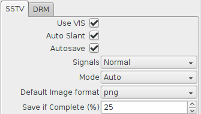
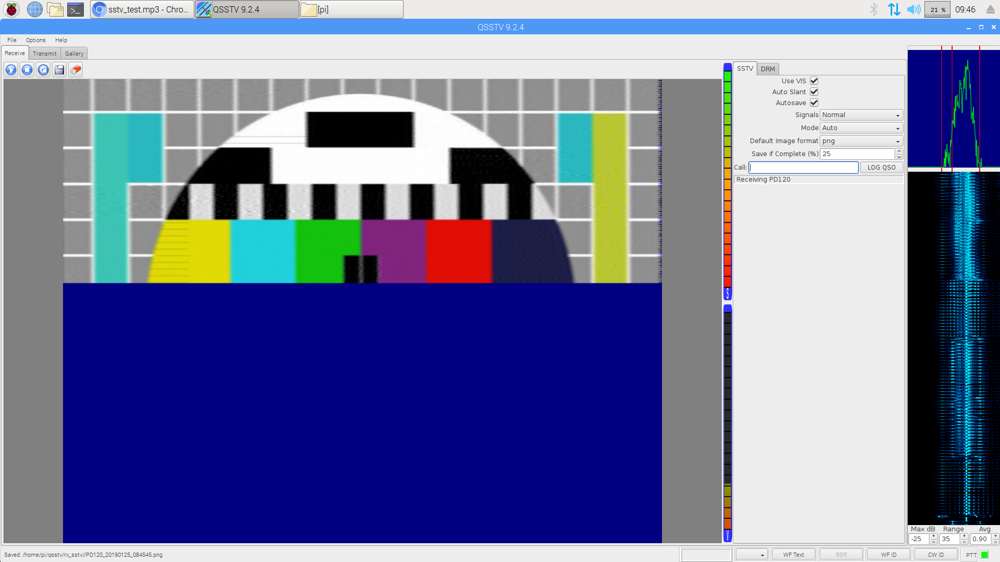
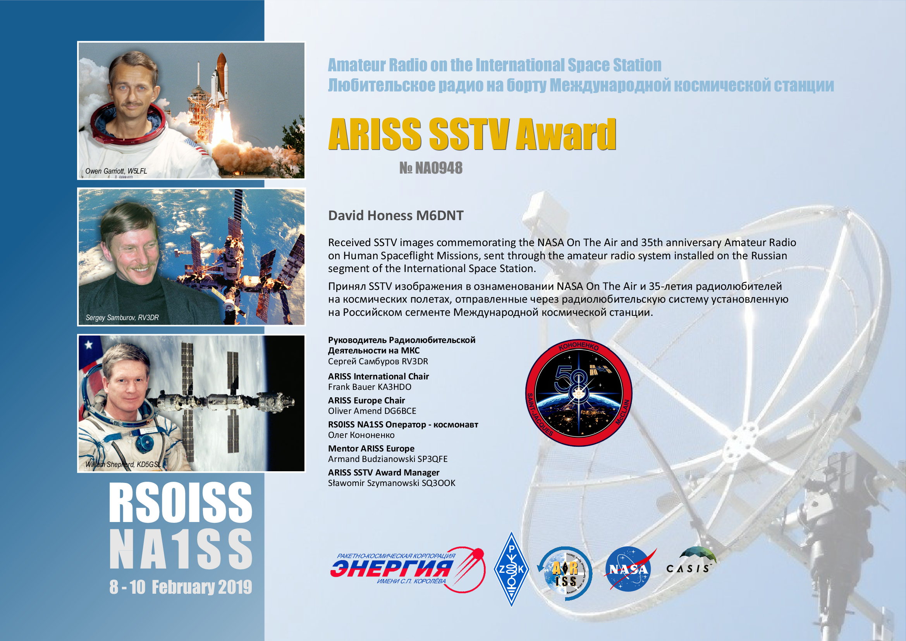

# An SSTV decoder setup for Raspbian

Have you ever wanted to receive a radio signal from space? It's fun and actually a lot easier than you might think!

## What is Slow Scan TV?

- Short answer
    - You convert a picture into sound, transmit the sound via radio, and convert the received sound back into a picture on the other end.

- Long answer
    - SSTV is a picture transmission method for transmitting and receiving static pictures via radio. Similar to a fax machine, or a 90s dial up modem, SSTV is an analogue audio signal that sounds like a high pitch racket of bleeps and screeches. It uses frequency modulation, where the frequency of a tone shifts up or down to designate pixel brightness and colour. A transmission consists of horizontal lines of pixels, scanned from left to right, encoded as audio. The audio is transmitted using radio and converted back into the picture at the other end using special software.

## SPAAAACE

The International Space Station has a long [history](https://www.spaceflightsoftware.com/ARISS_SSTV/archive.php) of transmitting SSTV pictures for [global events](http://ariss-sstv.blogspot.com/), each lasting several days, where people the world over tune their radios to the ISS and try to receive the pictures every time it flies over their home.

These are great fun to participate in and often there’s some healthy competition between people to see who can receive the pictures with the most clarity. You can monitor how well everyone else is doing by looking in the [#sstv](https://twitter.com/search?q=%23sstv) hashtags on social media.

A good reception | A reception with noise/interference
--- | ---
|

These instructions show you how to set up a ground station and receive SSTV pictures using just a Raspberry Pi computer and an RTL-SDR USB dongle. Why use a Raspberry Pi? This could be done using a desktop PC or Mac however you often need to leave the receiver running overnight, waiting for the ISS to fly over your location, and it's usually easier to tie up a Raspberry Pi with this task than your main utilitarian computer that you use all the time.

## Playing with SSTV on a mobile phone

To have a quick play, it is possible to install a mobile phone app that decodes SSTV through its microphone input. Playing the bleeps and screeches of an SSTV signal with the phone placed near the speaker is usually good enough.

- Android: [Robot36](https://play.google.com/store/apps/details?id=xdsopl.robot36)
- Apple IOS: [CQ SSTV](https://itunes.apple.com/us/app/sstv-slow-scan-tv/id387910013)

Here's an MP3 test file you can [download](https://raw.githubusercontent.com/davidhoness/sstv_decoder/master/sstv_test.mp3) and play.

This should work in a classroom provided there isn't too much background noise, if you ask everyone to install the app and then play the test recording at a reasonable volume all the phones will decode the picture. It will give everyone a good idea of how long it takes to obtain one image. Make sure you sneeze or cough half way through to show how this causes interference.

# Main instructions

## What you will need

- Raspberry Pi 2B or later, with the usual peripherals.
- RTL-SDR USB dongle (search RTL2832U).
  - Don't buy the little 30 cm mag-mount antennas. You will have little or no hope of picking up the ISS with them.
  - [This RTL-SDR starter kit](https://www.amazon.com/RTL-SDR-Blog-RTL2832U-Software-Telescopic/dp/B011HVUEME/) is good and comes with a nice beginners dipole antenna that will pick up the ISS.

## Initial setup and test

1. A guide for setting up your Raspberry Pi can be found [here](https://projects.raspberrypi.org/en/projects/raspberry-pi-setting-up).
1. We presume you are running Rasbian Stretch Desktop edition available [here](https://www.raspberrypi.org/downloads/).
1. Install prerequisites.
    - Start > Accessories > Terminal
    ```
    sudo apt-get update
    sudo apt-get install rtl-sdr sox pulseaudio qsstv ntpdate
    ```
1. Set the correct time.
    - Start > Preferences > Raspberry Pi Configuration > Localisation tab > Set Timezone
    - Change Area and Location accordingly > OK
    - Start > Accessories > Terminal
    ```
    sudo ntpdate pool.ntp.org
    ```
1. Insert RTL-SDR dongle and connect/deploy the antenna.
1. Verify RTL-SDR is working with `rtl_test` program.
    - Start > Accessories > Terminal
    ```
    rtl_test
    ```
    Expected output:
    ```
    Found 1 device(s):
      0:  MAKE, MODEL, SN: 00000001

    Using device 0: Generic RTL2832U OEM
    Found MAKE MODEL tuner
    Supported gain values (XX): XX, XX, XX...
    [R82XX] PLL not locked!
    Sampling at 2048000 S/s.

    Info: This tool will continuously read from the device, and report if
    samples get lost. If you observe no further output, everything is fine.

    Reading samples in async mode...
    ```
    Leave for 30 seconds and look out for any messages about loss of samples.
    Press `Ctrl-C` when 30 seconds as elapsed. The loss of 100 bytes or so is acceptable.
1. Verify RTL-SDR can tune to a commercial FM radio station with `rtl_fm` program. The command below pipes raw data from `rtl_fm` into to sox `play` which will then decode the raw data to produce audio output. Modify the value after the `-f` to specify your own FM station/frequency (98.8 is BBC Radio One in the UK).
    - Start > Accessories > Terminal
    ```
    rtl_fm -M wbfm -f 98.8M | play -r 32k -t raw -e s -b 16 -c 1 -V1 -
    ```
    Expected output:
    ```
    Found 1 device(s):
      0:  MAKE, MODEL, SN: 00000001

    Using device 0: Generic RTL2832U OEM

    -: (raw)

      Encoding: Signed PCM    
      Channels: 1 @ 16-bit   
    Samplerate: 32000Hz      
    Replaygain: off         
      Duration: unknown      

    Found MAKE MODEL tuner
    Tuner gain set to automatic.
    Tuned to 99071000 Hz.
    oversampling input by: 6x.
    Oversampling output by: 1x.
    Buffer size: 8.03ms
    Exact sample rate is: 1020000.026345 Hz
    Create UDP thread
    Created UDP thread
    Main socket started! :-) Tuning enabled on UDP/6020 
    Sampling at 1020000 S/s.
    Output at 170000 Hz.
    In:0.00% 00:00:02.60 [00:00:00.00] Out:XXXk  [ -====|====- ]        Clip:0    
    ```
    Note that the `Tuned to` value is doesn't match. This is due to [DC spike](https://www.rtl-sdr.com/tag/dc-spike/) and can be ignored. You should now be able to hear audio from the commercial FM station. Move the antenna around or select a different FM radio station with a closer transmitter if the audio is noisy. Press `Ctrl-C` to quit from `rtl_fm`.
1. Check QSSTV settings are correct.
    - Start > Internet > QSSTV
    - Options > Configuration > Sound tab
    
    
    
    - Audio Interface = `PulseAudio`
    - Input and Output Audio Device = `default -- Playback/recording through the PulseAudio sound server`
    - Sound Input = `From sound card`
    - Sound Output = `To sound card`
    - OK
1. Calibrate QSSTV.
    - Options > Calibrate
    
     
    
    - Go make a cup of tea/coffee.
    - Click `OK` when both progress bars reach 99%.
1. Verify QSSTV decodes slow scan TV test file correctly.
    - Download test file
    - Start > Accessories > Terminal
    ```
    wget https://raw.githubusercontent.com/davidhoness/sstv_decoder/master/sstv_test.mp3
    ```
    - Select `Receive` tab in QSSTV.
    
    
    
    - Use VIS = `ON`
    - Auto Slant = `ON`
    - Autosave = `ON`
    - Signals = `Normal`
    - Mode = `Auto`
    - Click play `►` button. Nothing will happen, but just click it to start the receiver.
    - Open `sstv_test.mp3` in the Chromium browser. You can either drag and drop the file from File Manager or just enter `file:///home/pi/sstv_test.mp3` into the address bar.
    - Let it play. Note that with VLC Media Player you get a skewed image sometimes.
    
     
    
    - Observe the decoding in QSSTV. Notice the FFT and waterfall display activity on the right of the screen.    
    - Other SSTV test recordings can be found online such as: https://soundcloud.com/spacecomms/pd120-sstv-test-recording

## Note regarding Doppler shift
1. What is it? A common example of [Doppler shift](https://en.wikipedia.org/wiki/Doppler_effect) is the change of pitch heard when a police car or ambulance passes you. Compared to the emitted frequency of the siren, the frequency you hear is higher during the approach, identical at the instant of passing by, and lower during departure. The same thing happens with radio waves as with sound waves.
    - The ISS is moving at ~27,600 km/h. This motion causes Doppler shift in the radio waves received at your location.
    - To compensate for the effects of Doppler shift, ground stations must continually re-tune their receiver as the ISS approaches, passes overhead and flies away.
    - As the ISS comes over the horizon (AOS or Acquisition of Signal) you would need to tune approx 3.5 kHz ABOVE 145.8 MHz.
    - At the instant when the ISS is directly overhead the actual transmitting frequency of 145.8 MHz can be used.
    - Just before ISS goes down over the horizon (LOS or Loss of Signal) you would need to tune approx 3.5 kHz BELOW 145.8 MHz.
    - The amount of re-tuning is dependent on the elevation of the ISS above the horizon. For example, an overhead pass requires a lot of re-tuning because there's a huge change in distance and relative speed as the ISS passes by. A low elevation pass, where it just peeks above the horizon and goes down again, requires relatively little.
    - No Doppler shift compensation is performed on the ISS. All compensation must all be handled by individual ground stations.
    - More information: https://www.qsl.net/ah6rh/am-radio/spacecomm/doppler-and-the-iss.html
    - Luckily **QSSTV can deal with Doppler shift itself** and so you don't have to do anything to compensate after tuning to 145.8 MHz.
1. If you want to do Doppler correction anyway it won't do any harm. It could, in fact, be a nice coding activity for a classroom.
1. [Here](https://github.com/davidhoness/sstv_decoder/blob/master/doppler.py) is a pre-made python script to compensate for Doppler shift. This program tracks the ISS using `ephem`, computes the Doppler corrected frequency for when the ISS is passing over and re-tunes `rtl_fm` via a UDP socket.
1. You will need to modify this python script to set your location. You can easily look up the latitude and longitude of your location using [Google Maps geocoder](https://google-developers.appspot.com/maps/documentation/utils/geocoder/). Usually the postal code and country is sufficient.

## Receive SSTV from the ISS

1. To do this you need to know three things:
    - When the ISS will be transmitting the SSTV signal. **It's not always on**.        
    - What frequency the SSTV signal will be transmitted on (usually 145.8 MHz).
    - When the ISS will fly over your location.
        - The ISS flies over most places a few times every day (unless you live in the Arctic/Antarctic).
1. You can find out when the ISS is transmitting here: http://ariss-sstv.blogspot.com/
    - There is often an SSTV event in April for the birthday of Yuri Gagarin.
    - They usually last for a few days at a time meaning you will get multiple ISS passes during which you can receive the SSTV signal.
1. You can look up when the ISS will next pass your location on: https://www.heavens-above.com/
    - Click `Unspecified` in the top right to set your location.
    - Type **your** postal code and country into *Enter place to search for* and click `Search`.
    - Scroll down and click `Update`.
    - You'll now be back on the home page, under *Satellites* click `ISS`.
    - Under *Passes to include* click `all`.
        - The *Alt* value under *Highest point* is the maximum elevation of the pass above the horizon, 90 would be directly overhead.
        - Passes with higher maximum elevation will give better results than lower ones.
    - Clicking on any row in the table shows the **sky chart** for that pass.
        - Imagine holding that picture above your head and aligning it with the compass directions.
        - The line shows the flight path of the ISS and this is useful for roughly positioning your antenna.
        - It can also be useful to look at the `Ground track` (see link in top right).
1. Plan ahead and set up your ground station with time to spare before the ISS flies over.
1. If you are using the RTL-SDR kit antenna, please read the getting started [guide](https://www.rtl-sdr.com/using-our-new-dipole-antenna-kit/) for it.
    - It's a good idea to adjust the length of the telescopic arms based on this dipole [calculator](http://www.csgnetwork.com/antennaedcalc.html) to match the antenna's resonant frequency to 145.8 MHz. This will help pick up weaker signals from low elevation passes.
        - Under `Desired Frequency` enter `145.8`
        - Under `Select Antenna Calculation` select `One Side`
        - Click `Calculate`
        - Remember there is about 2 cm of metal in each side of the antenna base. So take the calculated value and, before screwing in the arms, make them both this length minus 2 cm (excluding the screw threads). It doesn't have to be perfect but make it as close as possible.
    - To start with, deploy the dipole in a vertical v-shape and orient it with the flight path of the ISS that you find on https://www.heavens-above.com/
        - Perhaps a better way of saying this is, with the dipole flat, align it with the flight path of the ISS and then bend the two arms upwards into a right-angle v-shape.
    - Antennas and their performance are sometimes a bit of an art form as opposed to an exact science.
    - Experiment with different configurations on different ISS passes. Try one arm horizontal and one arm vertical for instance.
1. Try to get your antenna up as high as possible with a good view of the sky in all directions.
1. Set the correct time on the Raspberry Pi. QSSTV saves the images with a UTC time filename and this is useful later when working out which ISS passes they are from.
    - Start > Accessories > Terminal
    ```
    sudo ntpdate pool.ntp.org
    ```
1. Start `rtl_fm` in a Terminal window (keep this window open)
    - Start > Accessories > Terminal
    ```
    rtl_fm -M fm -f 145.8M -s 48k | play -r 48k -t raw -e s -b 16 -c 1 -V1 -
    ```
    - Note this command is different to the commercial radio station one. A commercial radio station uses wide band FM whereas the ISS transmission uses narrow band FM and so we have to set `rtl_fm` up differently.
1. **OPTIONAL:** If you are doing Doppler correction start `doppler.py` in *another* Terminal window (keep this window open too).
1. Start QSSTV
    - Start > Internet > QSSTV
    - Select `Receive` tab in QSSTV.
    - Use VIS = `ON`
    - Auto Slant = `ON`    
    - Autosave = `ON`
    - Mode = `Auto`
    - Save if Complete (%) = `10`
    - Click play `►` button.
    - FFT and waterfall display on the right should show noise coming from `rtl_fm`
1. Wait for the ISS to arrive. You may want to leave your ground station overnight or over the weekend to capture several passes.
1. **OPTIONAL:** If you are doing Doppler correction, you could manually set the system clock to one minute before an upcoming pass to test what the tuning will be like, although nothing will be received of course.
    - Start > Accessories > Terminal
    ```
    sudo date -s "YYYY-MM-DD HH:MM:SS"
    ```
    - Ensure you return the system clock to the correct time before leaving the ground station running.    
    ```
    sudo ntpdate pool.ntp.org
    ```
1. When you return to your ground station select the `Gallery` tab in QSSTV to see what images were received.
1. Go [here](https://www.spaceflightsoftware.com/ARISS_SSTV/index.php) to upload your SSTV images for recognition.
    - The pictures can be found in `/home/pi/qsstv/rx_sstv`
1. You can potentially get a certificate like this even if you only decode a few lines of one picture. Check the information on http://ariss-sstv.blogspot.com/ to find out how to apply for it. A great incentive for kids!
    
