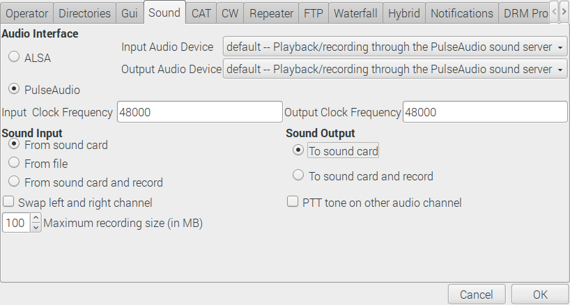
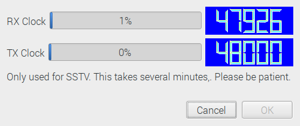

# An SSTV decoder setup for Raspbian

## What is Slow Scan TV?

SSTV is a picture transmission method for transmitting and receiving static pictures via radio. Similar to a fax machine, or a 90s dial up modem, SSTV is an analogue signal that resembles a high pitch cacophony of bleeps and screeches. It uses frequency modulation, where the signal frequency shifts up or down to designate pixel brightness and colour. A transmission consists of horizontal lines of pixels, scanned from left to right, encoded as audio. The audio is transmitted using radio and converted back into the picture at the other end using special software.

The International Space Station has a long [history](https://www.spaceflightsoftware.com/ARISS_SSTV/archive.php) of transmitting SSTV signals and these instructions show you how to receive them using just a Raspberry Pi computer and an RTL-SDR USB dongle. 

Why use a Raspberry Pi? This could be done using a desktop PC or Mac however you often need to leave the receiver running overnight, waiting for the ISS to fly over your location, and it's usually easier to tie up a Raspberry Pi with this task than your main utilitarian computer that you use all the time.


## Playing with SSTV on a mobile phone

To have a quick play, it is possible to install a mobile phone app that decodes SSTV through its microphone input. Playing the bleeps and screeches of an SSTV signal with the phone placed near the speaker is usually good enough.

- Android: [Robot36](https://play.google.com/store/apps/details?id=xdsopl.robot36)
- Apple IOS: [CQ SSTV](https://itunes.apple.com/us/app/sstv-slow-scan-tv/id387910013)

Here's an MP3 test file you can [download](https://raw.githubusercontent.com/davidhoness/sstv_decoder/master/sstv_test.mp3) and play.

This should work in a classroom provided there isn't too much background noise, if you ask everyone to install the app and then play the test recording at a reasonable volume all the phones will decode the picture. It will give everyone a good idea of how long it takes to obtain one image. Make sure you sneeze or cough half way through to show how this causes interference.

# Main instructions

## What you will need

- Raspberry Pi 2B or later, with the usual peripherals
- RTL-SDR USB dongle (search RTL2832U)
  - Don't buy the little 30 cm mag-mount antennas. You will have little or no hope of picking up the ISS with them.
  - [This starter kit](https://www.amazon.com/RTL-SDR-Blog-RTL2832U-Software-Telescopic/dp/B011HVUEME/) is recommended and comes with a good beginners antenna that will pick up the ISS.

## Initial setup and test

1. A guide for setting up your Raspberry Pi can be found [here](https://projects.raspberrypi.org/en/projects/raspberry-pi-setting-up).
1. We presume you are running Rasbian Stretch Desktop edition available [here](https://www.raspberrypi.org/downloads/)
1. Install prerequisites.
    - Start > Accessories > Terminal
    ```
    sudo apt-get update
    sudo apt-get install rtl-sdr sox pulseaudio qsstv ntpdate
    ```
1. Set the correct time.
    - Start > Preferences > Raspberry Pi Configuration > Localisation tab > Set Timezone
    - Change Area and Location accordingly > OK
    - Start > Accessories > Terminal
    ```
    sudo ntpdate pool.ntp.org
    ```
1. Insert RTL-SDR dongle and connect/deploy the antenna.
1. Verify RTL-SDR is working with `rtl_test` program.
    - Start > Accessories > Terminal
    ```
    rtl_test
    ```
    Expected output:
    ```
    Found 1 device(s):
      0:  MAKE, MODEL, SN: 00000001

    Using device 0: Generic RTL2832U OEM
    Found MAKE MODEL tuner
    Supported gain values (XX): XX, XX, XX...
    [R82XX] PLL not locked!
    Sampling at 2048000 S/s.

    Info: This tool will continuously read from the device, and report if
    samples get lost. If you observe no further output, everything is fine.

    Reading samples in async mode...
    ```
    Leave for 30 seconds and look out for any messages about loss of samples.
    Press `Ctrl-C` when 30 seconds as elapsed. The loss of 100 bytes or so is acceptable.
1. Verify RTL-SDR can tune to a commercial FM radio station with `rtl_fm` program. The command below pipes raw data from `rtl_fm` into to sox `play` which will then decode the raw data to produce audio output. Modify the value after the `-f` to specify your own FM station/frequency (98.8 is BBC Radio One in the UK).
    - Start > Accessories > Terminal
    ```
    rtl_fm -M wbfm -f 98.8M | play -r 32k -t raw -e s -b 16 -c 1 -V1 -
    ```
    Expected output:
    ```
    Found 1 device(s):
      0:  MAKE, MODEL, SN: 00000001

    Using device 0: Generic RTL2832U OEM

    -: (raw)

      Encoding: Signed PCM    
      Channels: 1 @ 16-bit   
    Samplerate: 32000Hz      
    Replaygain: off         
      Duration: unknown      

    Found MAKE MODEL tuner
    Tuner gain set to automatic.
    Tuned to 99071000 Hz.
    oversampling input by: 6x.
    Oversampling output by: 1x.
    Buffer size: 8.03ms
    Exact sample rate is: 1020000.026345 Hz
    Create UDP thread
    Created UDP thread
    Main socket started! :-) Tuning enabled on UDP/6020 
    Sampling at 1020000 S/s.
    Output at 170000 Hz.
    In:0.00% 00:00:02.60 [00:00:00.00] Out:XXXk  [ -====|====- ]        Clip:0    
    ```
    Note that the `Tuned to` value is doesn't match. This is due to [DC spike](https://www.rtl-sdr.com/tag/dc-spike/) and can be ignored. You should now be able to hear audio from the commercial FM station. Move the antenna around or select a different FM radio station with a closer transmitter if the audio is noisy. Press `Ctrl-C` to quit from `rtl_fm`.
1. Check QSSTV settings are correct.
    - Start > Internet > QSSTV
    - Options > Configuration > Sound tab
    
    
    
    - Audio Interface = `PulseAudio`
    - Input and Output Audio Device = `default -- Playback/recording through the PulseAudio sound server`
    - Sound Input = `From sound card`
    - Sound Output = `To sound card`
    - OK
1. Calibrate QSSTV.
    - Options > Calibrate
    
     
    
    - Go make a cup of tea/coffee.
    - Click `OK` when both progress bars reach 99%.
1. Verify QSSTV decodes slow scan TV test file correctly.
    - Download test file
    - Start > Accessories > Terminal
    ```
    wget https://raw.githubusercontent.com/davidhoness/sstv_decoder/master/sstv_test.mp3
    ```
    - Select `Receive` tab in QSSTV.
    
    
    
    - Use VIS = `ON`
    - Auto Slant = `ON`
    - Autosave = `ON`
    - Signals = `Normal`
    - Mode = `Auto`
    - Click play `►` button. Nothing will happen, but just click it to start the receiver.
    - Open `sstv_test.mp3` in Chromium browser. Let it play. Note that with VLC Media Player you get a skewed image sometimes.
    
     
    
    - Observe the decoding in QSSTV. Notice the FFT and waterflall display activity on the right of the screen.    
    - Other SSTV test recordings can be found online such as: https://soundcloud.com/spacecomms/pd120-sstv-test-recording

## Prepare to receive SSTV from the ISS

1. Note that the ISS is not always transmitting the SSTV signal. You can find out when it is here: http://ariss-sstv.blogspot.com/
    - There is often a week-long SSTV event in April for the birthday of Yuri Gagarin.
    - The usual SSTV frequency is 145.8 MHz.
1. Note regarding doppler shift: https://en.wikipedia.org/wiki/Doppler_effect
    - A common example of Doppler shift is the change of pitch heard when a police car or ambulance passes you. Compared to the emitted frequency of the siren, the frequency you hear is higher during the approach, identical at the instant of passing by, and lower during departure. The same thing happens with radio waves as with sound waves.
    - The ISS is moving at ~27,600 km/h. This motion causes doppler shift in the radio waves received at your location.
    - To compensate for the effects of Doppler shift, ground stations must continually re-tune their receiver as the ISS approaches, passes overhead and flies away.
    - As the ISS comes over the horizon (AOS or Acquisition of Signal) you would need to tune approx 3.5 kHz ABOVE 145.8 MHz.
    - At the instant when the ISS is directly overhead the actual transmitting frequency of 145.8 MHz can be used.
    - Just before ISS goes down over the horizon (LOS or Loss of Signal) you would need to tune approx 3.5 kHz BELOW 145.8 MHz.
    - The amount of re-tuning is dependent on the elevation of the ISS above the horizon. For example, an overhead pass requires a lot of re-tuning because there's a huge change in distance and relative speed as the ISS passes by. A low elevation pass, where it just peeks above the horizon and goes down again, requires relatively little.
    - **IMPORTANT:** No Doppler shift compensation is performed on the ISS. All compensation must all be handled by individual ground stations.
    - More information: https://www.qsl.net/ah6rh/am-radio/spacecomm/doppler-and-the-iss.html
1. Download a pre-made python script to compensate for doppler shift. This program tracks the ISS using `ephem`, computes the doppler corrected frequency for when the ISS is passing over and re-tunes `rtl_fm` via a UDP socket. With QSSTV running in the background you should be able to receive pictures from the ISS.
    - Start > Accessories > Terminal
    ```
    wget https://raw.githubusercontent.com/davidhoness/sstv_decoder/master/doppler.py
    chmod +x doppler.py
    ```
1. Modify the python script to set your location. Current location is set to ESTEC in the Netherlands.
    - First look up the latitude and longitude of your location using [Google Maps geocoder](https://google-developers.appspot.com/maps/documentation/utils/geocoder/). Usually the postal code and country is sufficient.
    - Open the file `doppler.py` for editing
    ```
    nano doppler.py
    ```
    - Edit the capitalised variables to specify your location, the altitude can be an approximation.    
    ```python
    LATITUDE = "52.219308"
    LONGITUDE = "4.419926"
    ALTITUDE = 20
    ```
    - Please also feel free to review the rest of the code at this time.
        - Note, writing this code could form a nice classroom activity however for this test the code is provided ready to go.
    - Save the changes by pressing `Ctrl-O`, followed by `Enter` and then `Ctrl-X` to quit.

## Final setup

1. Ensure the Raspberry Pi is online via Ethernet or WiFi. This is needed so `doppler.py` can get the ISS telemetry data and keep it updated.
1. Start `rtl_fm` in a Terminal window (keep this window open)
    - Start > Accessories > Terminal
    ```
    rtl_fm -f 145.8M -M fm -s 170k -A fast -l 0 | play -r 170k -t raw -e s -b 16 -c 1 -V1 -
    ```
1. Start `doppler.py` in *another* Terminal window (keep this window open too)
    - Start > Accessories > Terminal
    ```
    ./doppler.py
    ```
1. Start QSSTV
    - Start > Internet > QSSTV
    - Select `Receive` tab in QSSTV.
    - Use VIS = `ON`
    - Auto Slant = `ON`    
    - Autosave = `ON`
    - Mode = `Auto`
    - Click play `►` button.
    - FFT and waterflall display on the right should show noise coming from `rtl_fm`
1. Wait for the ISS to arrive. You may want to leave your ground station overnight or over the weekend to capture several passes.
    - You can look up when the ISS will next pass your location on: https://www.heavens-above.com/
        - Click `Unspecified` in the top right to set your location
        - On the home page, under *Satellites* click `ISS`
        - Under *Passes to include* click `all`
1. **OPTIONAL:** Before you leave your ground station overnight. Run these commands to increase the process priority for the main four programs we're using in this setup.
    - Start > Accessories > Terminal
    ```
    sudo renice -1 $(pgrep rtl_fm)
    sudo renice -1 $(pgrep play)
    sudo renice -1 $(pgrep qsstv)
    sudo renice -1 $(pgrep doppler)
    ```
1. **OPTIONAL:** If you want to, you could manually set the system clock to one minute before an upcoming pass to test what the tuning will be like, although noting will be received of course.
    - Start > Accessories > Terminal
    ```
    sudo date -s "YYYY-MM-DD HH:MM:SS"
    ```
    - Ensure you return the system clock to the correct time before leaving the ground station running.
    - When you return to your ground station select the `Gallery` tab in QSSTV to see what images were received.
